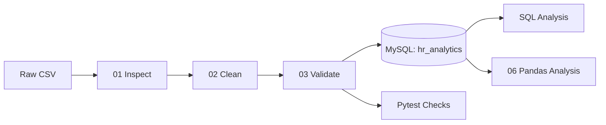

# Employee Data Quality & HR Analytics ETL Pipeline

An end-to-end HR data quality and analytics pipeline built with **Python, Pandas, MySQL, SQL, and Pytest**.

The project takes a raw employee dataset through inspection, cleaning, validation, database loading, SQL analysis, and Python-based business analysis. Automated Pytest checks are used to verify key data-quality conditions throughout the workflow.

**Stack:** Python · Pandas · MySQL · SQL · Pytest
**Dataset:** Synthetic HR dataset · 1,000 employees · 14 attributes

---

## 📌 Project Overview

HR datasets can contain missing values, inconsistent text, invalid values, and other data-quality issues that can affect downstream analysis.

This project demonstrates a reproducible workflow for turning raw employee data into a clean, validated, database-ready dataset and extracting descriptive HR insights from it.

```text
Raw Employee CSV
       ↓
Data Inspection
       ↓
Data Cleaning
       ↓
Data Validation
       ↓
MySQL Database
       ↓
SQL Analysis
       ↓
Python / Pandas Analysis
       ↓
Business Insights
```

The project focuses on both **data preparation** and **analytics**, rather than analyzing a CSV file in isolation.

---

## 📊 Results at a Glance

| Metric                        |    Result |
| ----------------------------- | --------: |
| Raw records                   | **1,000** |
| Attributes                    |    **14** |
| Missing values found          |    **51** |
| Missing salaries              |    **32** |
| Missing performance ratings   |    **19** |
| Missing values after cleaning |     **0** |
| Duplicate rows                |     **0** |
| Duplicate Employee IDs        |     **0** |
| Rows loaded into MySQL        | **1,000** |
| SQL analyses                  |     **9** |
| Automated Pytest checks       |     **9** |

---

## 🔄 ETL Pipeline



### Pipeline Steps

| Step | Script                               | Purpose                                                                                                      |
| ---- | ------------------------------------ | ------------------------------------------------------------------------------------------------------------ |
| 1    | `src/01_inspect_data.py`             | Inspects shape, data types, missing values, duplicates, categories, whitespace, dates, IDs, and value ranges |
| 2    | `src/02_clean_data.py`               | Cleans text fields, handles missing salaries and ratings, and converts `Join_Date`                           |
| 3    | `src/03_validate_cleaned_data.py`    | Validates the cleaned dataset for missing values, duplicates, ratings, dates, and other conditions           |
| 4    | `src/04_test_mysql_connection.py`    | Tests the MySQL connection using local `.env` credentials                                                    |
| 5    | `src/05_load_to_mysql.py`            | Loads the cleaned dataset into the MySQL `employees` table                                                   |
| 6    | `src/06_python_business_analysis.py` | Reads the MySQL table into Pandas and performs additional business analysis                                  |

---

# 📁 Dataset

The project uses a **synthetic HR employee dataset** containing:

* **1,000 employees**
* **14 attributes**

### Dataset Columns

| Column               | Description                          |
| -------------------- | ------------------------------------ |
| `Employee_ID`        | Unique employee identifier           |
| `Name`               | Employee name                        |
| `Age`                | Employee age                         |
| `Gender`             | Employee gender                      |
| `City`               | Employee city                        |
| `Education`          | Education level                      |
| `Department`         | Employee department                  |
| `Job_Title`          | Employee job title                   |
| `Join_Date`          | Date the employee joined the company |
| `Years_at_Company`   | Years spent at the company           |
| `Salary_INR`         | Salary in INR                        |
| `Performance_Rating` | Employee performance rating          |
| `Leaves_Taken`       | Number of leaves taken               |
| `Employment_Status`  | Current employment status            |

> **Note:** The dataset is synthetic. The findings in this project describe this dataset only and should not be interpreted as real-world HR statistics.

---

# 🔍 Step 1 — Data Inspection

The raw dataset is inspected before any transformation is performed.

The inspection script:

```text
src/01_inspect_data.py
```

checks:

* Dataset shape
* Data types
* Missing values
* Duplicate rows
* Duplicate employee IDs
* Category values
* Whitespace
* Date ranges
* Employee ID format
* Numeric ranges
* Basic data validity

### Initial Dataset

```text
Rows:       1,000
Columns:       14
```

### Missing Values

| Column               | Missing Values |
| -------------------- | -------------: |
| `Salary_INR`         |             32 |
| `Performance_Rating` |             19 |
| Other columns        |              0 |
| **Total**            |         **51** |

Additional checks found:

```text
Duplicate rows:          0
Duplicate Employee IDs:  0
```

The salary values ranged from approximately:

```text
₹28,900 → ₹1,60,400
```

No invalid join dates or other obvious invalid values were identified by the inspection checks.

---

# 🧹 Step 2 — Data Cleaning

The cleaning process is implemented in:

```text
src/02_clean_data.py
```

### 1. Remove unnecessary whitespace

Leading and trailing whitespace is removed from relevant text columns, including:

* `Employee_ID`
* `Name`
* `Gender`
* `City`
* `Education`
* `Department`
* `Job_Title`
* `Performance_Rating`
* `Employment_Status`

This prevents visually identical values from being treated as different categories.

---

### 2. Handle Missing Salaries

The raw dataset contained **32 missing salary values**.

The overall dataset median salary was:

**₹67,250**

Missing salary values were replaced using this median.

### Why median?

Salary distributions can contain relatively high values that can influence the mean. The median provides a more robust central value for this synthetic dataset.

This is a documented project-level decision rather than a universal HR rule.

In a real organization, missing salary records should first be investigated to determine why the values are missing before selecting an imputation strategy.

---

### 3. Handle Missing Performance Ratings

The dataset contained **19 missing performance ratings**.

Rather than assigning an artificial rating, these values were represented as:

```text
Not Rated
```

This preserves the distinction between an employee who has no recorded rating and an employee who received an actual performance assessment.

---

### 4. Convert Join Date

`Join_Date` is converted from text into a proper datetime representation so that it can be validated and stored using MySQL's `DATE` type.

---

### 5. Save the Cleaned Dataset

The resulting dataset is saved to:

```text
data/cleaned/employee_data_cleaned.csv
```

---

# ✅ Step 3 — Data Validation

The cleaned dataset is validated using:

```text
src/03_validate_cleaned_data.py
```

The validation checks:

* Dataset shape
* Missing values
* Duplicate rows
* Duplicate employee IDs
* Performance rating categories
* Salary values
* Join-date validity

### Validation Results

```text
Dataset shape: (1000, 14)

Missing values:           0
Duplicate rows:           0
Duplicate Employee IDs:   0
Invalid Join_Date values: 0
```

The cleaned dataset therefore contains:

* **1,000 records**
* **0 missing values**
* **0 duplicate rows**
* **0 duplicate Employee IDs**

---

# 🗄️ Step 4 — MySQL Database

The project uses **MySQL** as the relational database layer.

The database connection is tested using:

```text
src/04_test_mysql_connection.py
```

Database credentials are stored locally using environment variables.

Example:

```text
MYSQL_HOST=localhost
MYSQL_PORT=3306
MYSQL_USER=root
MYSQL_PASSWORD=your_password
MYSQL_DATABASE=hr_analytics
```

The actual `.env` file is excluded from GitHub.

---

# 🏗️ Step 5 — Database Schema

The database schema is defined in:

```text
sql/schema.sql
```

The script creates:

```text
hr_analytics
└── employees
```

The `employees` table contains the 14 employee attributes.

`Employee_ID` is used as the primary key, while the remaining fields use appropriate SQL data types such as `VARCHAR`, `INT`, `DATE`, and `DECIMAL`.

### Database Design

MySQL was selected to demonstrate a server-based relational database workflow and SQL analysis using MySQL Workbench.

The loading process is also repeatable: the existing employee records are cleared before the cleaned dataset is inserted, preventing duplicate accumulation across repeated runs.

---

# 📥 Step 6 — Load Data into MySQL

The cleaned dataset is loaded using:

```text
src/05_load_to_mysql.py
```

The script:

1. Reads the cleaned CSV using Pandas
2. Connects to MySQL
3. Selects the `hr_analytics` database
4. Clears existing records from the `employees` table
5. Inserts the cleaned records
6. Commits the transaction
7. Reports the number of rows loaded

### Load Result

```text
Rows loaded: 1000
```

The loaded data was verified using SQL:

```sql
USE hr_analytics;

SELECT COUNT(*) AS total_employees
FROM employees;
```

Result:

```text
1000
```

---

# 📈 Step 7 — SQL Analysis

SQL analysis is stored in:

```text
sql/analysis.sql
```

The project answers the following HR-related questions:

1. Overall HR summary
2. Employee distribution and average salary by department
3. Employment status overview
4. Performance rating overview
5. Employment status within departments
6. Salary by education level
7. Leave patterns by department
8. Salary by years at company
9. Top 10 highest-paid employees

The SQL analysis demonstrates practical use of:

* `SELECT`
* `WHERE`
* `GROUP BY`
* `ORDER BY`
* `COUNT`
* `AVG`
* `MAX`
* Filtering
* Aggregation
* Sorting

---

# 🧮 Step 8 — Python / Pandas Business Analysis

Additional analysis is performed using:

```text
src/06_python_business_analysis.py
```

The script:

* Connects to MySQL
* Loads the employee table into a Pandas DataFrame
* Calculates overall statistics
* Analyzes departments
* Analyzes employment status
* Analyzes performance ratings
* Identifies highest-paid employees

This demonstrates how **SQL and Python/Pandas can be used together** within an analytics workflow.

---

# 📊 Key Findings

## Overall Summary

| Metric                   |     Result |
| ------------------------ | ---------: |
| Total employees          |      1,000 |
| Average age              |      38.54 |
| Average salary           | ₹71,892.50 |
| Average years at company |       4.90 |
| Average leaves taken     |      15.15 |

---

## Department Analysis

| Department       | Employees | Average Salary |
| ---------------- | --------: | -------------: |
| Operations       |       174 |     ₹63,111.78 |
| Finance          |       157 |     ₹80,607.64 |
| Customer Support |       146 |     ₹49,149.32 |
| Engineering      |       141 |   ₹1,07,484.04 |
| Sales            |       136 |     ₹71,267.28 |
| Marketing        |       132 |     ₹70,286.36 |
| HR               |       114 |     ₹61,003.95 |

Within this synthetic dataset, Engineering has the highest average salary among the listed departments, while Customer Support has the lowest.

These differences are descriptive and do not establish why salary differences exist.

---

## Employment Status

| Status     | Employees | Average Salary | Average Leaves |
| ---------- | --------: | -------------: | -------------: |
| Active     |       649 |     ₹71,593.45 |          14.94 |
| Terminated |       184 |     ₹71,288.59 |          15.50 |
| Resigned   |       167 |     ₹73,720.06 |          15.60 |

---

## Performance Rating

| Rating    | Employees | Average Salary | Average Leaves |
| --------- | --------: | -------------: | -------------: |
| Excellent |       257 |     ₹73,151.75 |          15.63 |
| Good      |       247 |     ₹72,992.31 |          15.01 |
| Average   |       242 |     ₹71,869.21 |          14.81 |
| Poor      |       235 |     ₹69,565.96 |          15.08 |
| Not Rated |        19 |     ₹69,634.21 |          16.05 |

`Not Rated` represents the 19 performance ratings that were missing in the original dataset.

---

## Education Analysis

| Education  | Employees | Average Salary |
| ---------- | --------: | -------------: |
| PhD        |       258 |     ₹72,791.47 |
| Bachelor's |       234 |     ₹72,244.66 |
| Diploma    |       277 |     ₹71,385.02 |
| Master's   |       231 |     ₹71,140.26 |

The average salary differences between education groups are relatively small in this dataset.

---

## Leave Patterns

| Department       | Employees | Average Leaves | Maximum Leaves |
| ---------------- | --------: | -------------: | -------------: |
| Engineering      |       141 |          15.75 |             30 |
| Sales            |       136 |          15.54 |             30 |
| Finance          |       157 |          15.43 |             30 |
| Marketing        |       132 |          15.28 |             30 |
| HR               |       114 |          15.07 |             30 |
| Customer Support |       146 |          14.86 |             30 |
| Operations       |       174 |          14.32 |             30 |

The maximum recorded leave count is 30 across all departments.

---

## Salary by Years at Company

| Years | Employees | Average Salary |
| ----: | --------: | -------------: |
|     1 |       116 |     ₹66,825.43 |
|     2 |       124 |     ₹67,561.29 |
|     3 |       111 |     ₹72,597.30 |
|     4 |       111 |     ₹73,075.23 |
|     5 |       115 |     ₹71,907.83 |
|     6 |       101 |     ₹74,057.92 |
|     7 |        97 |     ₹71,114.95 |
|     8 |       128 |     ₹77,867.58 |
|     9 |        96 |     ₹72,242.19 |
|    10 |         1 |     ₹43,800.00 |

The 10-year group contains only one employee and therefore should not be interpreted as a meaningful salary trend.

---

# 🔎 Data Quality Summary

```text
Raw records                    1,000
Raw attributes                    14

Missing salaries                  32
Missing performance ratings       19
Total missing values              51

Duplicate rows                     0
Duplicate Employee IDs             0

Cleaned records                1,000
Missing values after cleaning      0
```

### Missing Salary Handling

```text
32 missing salaries
        ↓
Dataset median
₹67,250
        ↓
Missing salaries replaced
```

### Missing Rating Handling

```text
19 missing ratings
        ↓
"Not Rated"
        ↓
Missing ratings represented explicitly
```

---

# 🧪 Automated Testing

The project uses **Pytest** to validate the cleaned dataset.

Tests are located in:

```text
tests/test_cleaned_data.py
```

Run the test suite with:

```bash
pytest -v
```

### Data Quality Tests

| Test              | Purpose                                                  |
| ----------------- | -------------------------------------------------------- |
| Shape             | Confirms exactly 1,000 rows and 14 columns               |
| Column names      | Confirms the expected schema                             |
| No missing values | Confirms cleaning removed missing values                 |
| No duplicates     | Confirms unique rows and Employee IDs                    |
| Salary            | Confirms numeric and positive salary values              |
| Rating categories | Confirms only expected rating categories are present     |
| Employment status | Confirms only expected status values are present         |
| Join dates        | Confirms valid and non-future dates                      |
| Whitespace        | Confirms text fields have no leading/trailing whitespace |

This adds a reproducible quality-control layer instead of relying only on manual inspection.

---

# 📁 Project Structure

```text
Employee-Data-Quality-ETL/
│
├── data/
│   ├── raw/
│   │   └── employee_data.csv
│   │
│   └── cleaned/
│       └── employee_data_cleaned.csv
│
├── sql/
│   ├── schema.sql
│   └── analysis.sql
│
├── src/
│   ├── 01_inspect_data.py
│   ├── 02_clean_data.py
│   ├── 03_validate_cleaned_data.py
│   ├── 04_test_mysql_connection.py
│   ├── 05_load_to_mysql.py
│   └── 06_python_business_analysis.py
│
├── tests/
│   └── test_cleaned_data.py
│
├── .env.example
├── .gitignore
├── requirements.txt
└── README.md
```

> `.env` is created locally from `.env.example` and is not committed to GitHub.

---

# ▶️ How to Run

## 1. Clone the repository

```bash
git clone https://github.com/SalehaSamreen/Employee-Data-Quality-ETL.git
cd Employee-Data-Quality-ETL
```

## 2. Create a virtual environment

### Windows

```bash
python -m venv venv
venv\Scripts\activate
```

## 3. Install dependencies

```bash
pip install -r requirements.txt
```

## 4. Configure MySQL

Copy `.env.example` to `.env` and provide your local MySQL credentials:

```text
MYSQL_HOST=localhost
MYSQL_PORT=3306
MYSQL_USER=root
MYSQL_PASSWORD=your_password
MYSQL_DATABASE=hr_analytics
```

Do not commit `.env` to GitHub.

## 5. Inspect the raw data

```bash
python src/01_inspect_data.py
```

## 6. Clean the data

```bash
python src/02_clean_data.py
```

This creates:

```text
data/cleaned/employee_data_cleaned.csv
```

## 7. Validate the cleaned data

```bash
python src/03_validate_cleaned_data.py
```

Expected validation:

```text
Missing values → 0
Duplicate rows → 0
Duplicate Employee IDs → 0
Invalid Join_Date values → 0
```

## 8. Test the MySQL connection

Make sure MySQL Server is running:

```bash
python src/04_test_mysql_connection.py
```

Expected result:

```text
MySQL connection successful.
```

## 9. Create the database and table

Open:

```text
sql/schema.sql
```

in MySQL Workbench and execute it.

This creates:

```text
hr_analytics
└── employees
```

## 10. Load the cleaned data

```bash
python src/05_load_to_mysql.py
```

Expected result:

```text
Rows loaded: 1000
```

## 11. Run Python business analysis

```bash
python src/06_python_business_analysis.py
```

## 12. Run Pytest

```bash
pytest -v
```

## 13. Run SQL analysis

Open:

```text
sql/analysis.sql
```

in MySQL Workbench and execute the queries.

---

# 🔐 Security

Database credentials are stored only in a local `.env` file.

The `.env` file is excluded from Git using `.gitignore`.

No database password is committed to this repository.

A `.env.example` file can be used as a safe template for configuring the project locally.

---

# ⚠️ Limitations

* The dataset is synthetic and does not represent a real organization's workforce.
* The pipeline currently consists of manually executed Python scripts rather than a scheduled or orchestrated workflow.
* Salary imputation uses one overall dataset median.
* The analysis is descriptive and identifies differences in the dataset but does not establish their causes.
* The project has not been evaluated against production-scale HR data.

### Salary Imputation Limitation

The overall median salary used for missing values was **₹67,250**.

Department-level medians differ substantially, so a real HR system could require a more context-specific approach. For this project, the overall median was selected as a documented and reproducible rule for the synthetic dataset.

In a real HR environment, missing salary records should first be investigated to determine the reason for the missing data before selecting an imputation strategy.

---

# 🚀 Possible Next Steps

* Compare overall-median and department-median salary imputation
* Add a Power BI or Streamlit dashboard
* Generate an automated data-quality report
* Add additional validation rules
* Run Pytest automatically using GitHub Actions
* Schedule the ETL pipeline for recurring execution

---

# 💡 What This Project Demonstrates

This project demonstrates an end-to-end **Data Analyst workflow**:

```text
Python / Pandas
       ↓
Data Quality
       ↓
ETL
       ↓
MySQL
       ↓
SQL
       ↓
Python Analysis
       ↓
Business Insights
       ↓
Automated Testing
```

Rather than analyzing a raw CSV in isolation, the project demonstrates how data can be:

**inspected → cleaned → validated → loaded into a relational database → analyzed with SQL and Python → tested automatically.**

---

# 📌 Project Outcome

Starting with a raw dataset of **1,000 employee records**, the pipeline:

* Identified **51 missing values**
* Handled **32 missing salary values**
* Represented **19 missing performance ratings** as `Not Rated`
* Removed unnecessary whitespace
* Validated the cleaned dataset
* Confirmed **0 duplicate rows**
* Confirmed **0 duplicate Employee IDs**
* Produced **0 missing values after cleaning**
* Loaded all **1,000 cleaned records into MySQL**
* Performed **9 SQL analyses**
* Performed additional analysis using Python and Pandas
* Added **9 automated Pytest checks**
* Extracted descriptive HR insights from the cleaned dataset

The final result is a reproducible HR analytics ETL pipeline demonstrating practical skills in **Python, Pandas, data quality, ETL, MySQL, SQL, and automated testing**.
